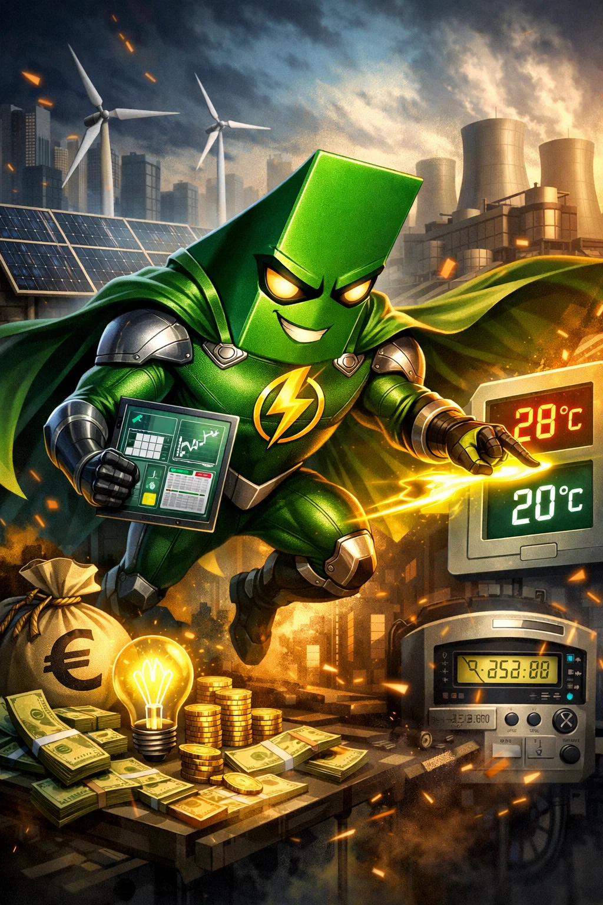
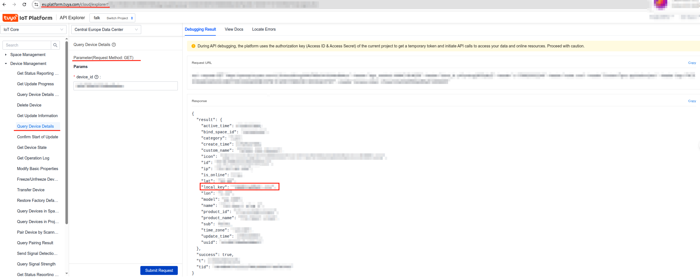

<p align="center">
  
</p>

# Falk
Falk was conceived due to the need to save electricity consumption. 
It aims to be a planner, controller, and manager of a space's electricity consumption.

## Installation
``` bash
uv sync
```

## Setup
``` bash
source .venv/bin/activate
tinytuya scan
```

After that, you will get a list of devices with their `id` but without the `local_key`. 
You will need to log In in [Tuya Platform](https://platform.tuya.com/) and after that 
go to [Tuya API Explorer](https://eu.platform.tuya.com/cloud/explorer) to retrieve the `local_key`. 



## Web
```bash
npm run dev
```

or 

```bash
npm run build
npm run preview
```


