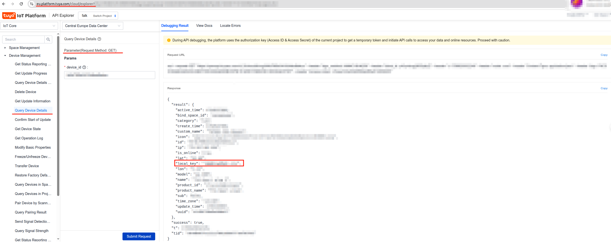

<p align="center">
  
</p>

# Falk
Falk was conceived due to the need to save electricity consumption. 
It aims to be a planner, controller, and manager of a space's electricity consumption.

## Installation
``` bash
uv sync
```

## Setup
``` bash
source .venv/bin/activate
tinytuya scan
```

After that, you will get a list of devices with their `id` but without the `local_key`. 
You will need to log In in [Tuya Platform](https://platform.tuya.com/) and after that 
go to [Tuya API Explorer](https://eu.platform.tuya.com/cloud/explorer) to retrieve the `local_key`. 



## Database

### New Database Tables
New database tables can be created with:
```bash
alembic upgrade head
```

### Database Migrations

Database migrations can be created with:
```bash
alembic revision --autogenerate -m "message"
alembic upgrade head
```

### Some Database Queries
```sql
SELECT 
    s.name, 
    sm.current, 
    sm.voltage, 
    sm.power, 
    sm.recorded_at
FROM 
    switch_metric sm
JOIN 
    smart_switch s ON sm.switch_id = s.id
ORDER BY 
    sm.recorded_at DESC
LIMIT 15;
```

or in a single line:
```sql
SELECT s.name, sm.current, sm.voltage, sm.power, sm.recorded_at FROM switch_metric sm JOIN smart_switch s ON sm.switch_id = s.id ORDER BY sm.recorded_at DESC LIMIT 15;
```

## Web
```bash
cd web
npm run dev
```

or 

```bash
cd web
npm run build
npm run preview
```


