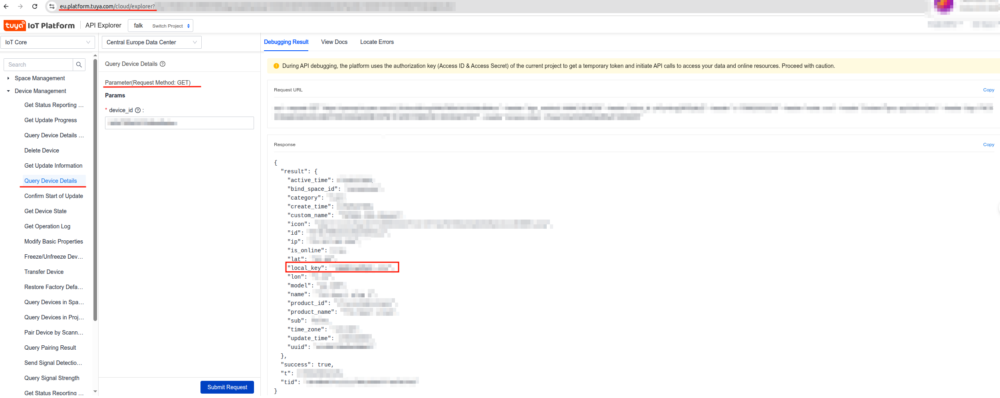

<p align="center">
  
</p>

# Falk
Falk was conceived due to the need to save electricity consumption. 
It aims to be a planner, controller, and manager of a space's electricity consumption.

## Installation
``` bash
uv sync
```

## Setup
``` bash
source .venv/bin/activate
tinytuya scan
```

After that, you will get a list of devices with their `id` but without the `local_key`. 
You will need to log In in [Tuya Platform](https://platform.tuya.com/) and after that 
go to [Tuya API Explorer](https://eu.platform.tuya.com/cloud/explorer) to retrieve the `local_key`. 



## Database

### New Database Tables
New database tables can be created with:
```bash
alembic upgrade head
```

### Database Migrations

Database migrations can be created with:
```bash
uv run -- alembic revision --autogenerate -m "message"
uv run -- alembic upgrade head
```

### Some Database Queries
```sql
SELECT 
    s.name, 
    sm.current, 
    sm.voltage, 
    sm.power, 
    sm.recorded_at
FROM 
    switch_metric sm
JOIN 
    smart_switch s ON sm.switch_id = s.id
ORDER BY 
    sm.recorded_at DESC
LIMIT 15;
```

or in a single line:
```sql
SELECT s.name, sm.current, sm.voltage, sm.power, sm.recorded_at FROM switch_metric sm JOIN smart_switch s ON sm.switch_id = s.id ORDER BY sm.recorded_at DESC LIMIT 15;
```

Query Energy Meter metrics
```sql
SELECT * FROM energy_meter JOIN em_metric ON energy_meter.id = em_metric.em_id JOIN energy_phase ON em_metric.id = energy_phase.em_metric_id;
```

### Examples how to add devices
```python
from falk import telemetry

telemetry.add_em_device('sqlite:///falk.db', name='Energy Meter SAXI Home', model='Shelly 3EM-63W', ip='192.168.1.132', shelly_id='em:0')
telemetry.add_switch_device('sqlite:///falk.db', name='TSP004-20A-daewoo', ip='192.168.1.118', tuya_id='*', local_key='*', version='3.4')
```

### Examples how to query live results
```python
from falk.iot import shelly, tuya

em = shelly.EnergyMeter('192.168.1.132').refresh()
print(em)

sw = tuya.Switch(id='*', name='TSP004-20A-daewoo', ip='192.168.1.118', local_key='*', version='3.4').refresh()
print(sw)
```


## Web Dashboard

A read-only React dashboard (served by a FastAPI JSON API) visualizes the
consumption: a main gauge with the live total, one gauge per phase, a per-device
breakdown donut, a consumption ranking, and power/energy time series. The plugs
section can also switch each Tuya plug on/off.

### Development (two processes)
Run the API and the Vite dev server separately; Vite proxies `/api` to the API.
```bash
# Terminal 1 — API with auto-reload on :8000
rm -f falk.db-wal falk.db-shm
uv run uvicorn falk.api.main:app --reload --port 8000

# Terminal 2 — frontend dev server on :5173 (proxies /api -> :8000)
cd frontend
npm install
npm run dev
```
Open http://localhost:5173.

### Production (single process)
Build the SPA once, then serve everything from the API on one port. The build
output goes to `src/falk/api/static/` and is served by the API (deep links fall
back to `index.html`).
```bash
cd frontend && npm install && npm run build
cd ..
uv run falk-api          # host/port via FALK_API_HOST / FALK_API_PORT (default 127.0.0.1:8000)
```
Open http://localhost:8000.

> On a Raspberry Pi: use a 64-bit OS (so `uv` can fetch Python 3.14 and ARM
> wheels), and build the frontend on another machine, copying
> `src/falk/api/static/` to the Pi — the Pi does not need Node.js.

The dashboard auto-refreshes every minute and reads the same database the
telemetry cron writes to (SQLite WAL mode handles concurrent read/write).

## Telemetry Cronjob
```bash
#!/usr/bin/env bash

cd $HOME/repos/falk

uv run -- python -m falk.telemetry
```

then in Crontab:
```bash
*/5 * * * * sh $HOME/falk-telemetry-cronjob.sh &> /dev/null
```

# Links and Resources

[EnergiaXXI](https://www.energiaxxi.com/)
[EIOS REE](https://www.esios.ree.es/es)
[EIOS REE daily prices](api.esios.ree.es/archives/71/download)


